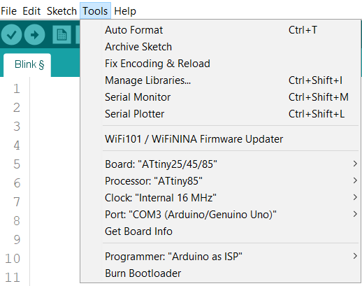
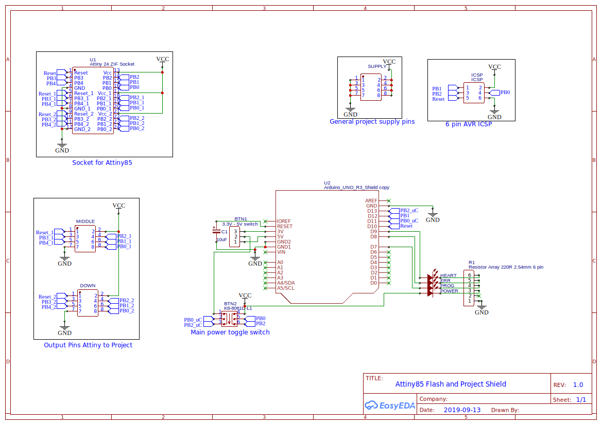
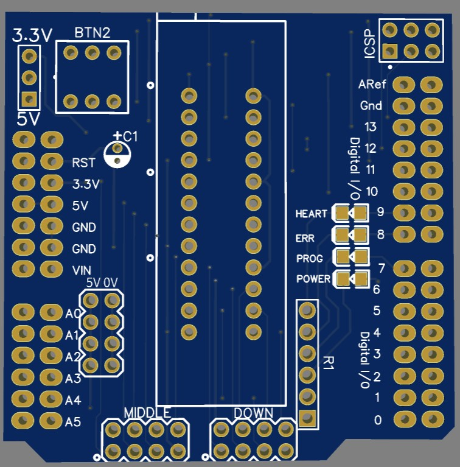
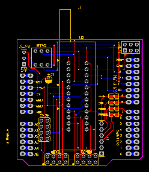
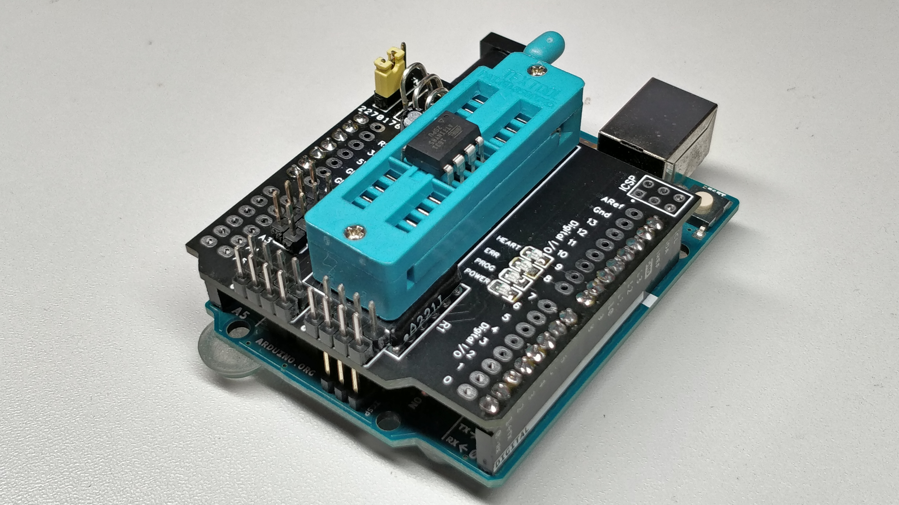

# Attiny 85 Flashhat

One pcb for programming and connecting projects for Attiny 85

## What is the Attiny 85 Flashhat

The basic idea was to make an all in one solution for programming and operating own projects on one pcb. Due to the 5 GPIOs on the Attiny 85 the programming pins are also the operating pins.

Therefor the Attiny 85 can be placed in the socket and depending on the location gets programmed or used in projects.


## Initialising Hardware

The Flashhat is mounted on top of an Arduino Uno with the Code of [ArduinoISP](https://github.com/arduino/Arduino/blob/master/build/shared/examples/11.ArduinoISP/ArduinoISP/ArduinoISP.ino)

Make sure that power and heartbeat Led are active.

## Programming Attiny 85

With the help of the releasing socket, put the Attiny 85 in the upper of 3 parts of the socket.

#### For Arduino IDE: 

Import the [Attiny Libary](https://raw.githubusercontent.com/damellis/attiny/ide-1.6.x-boards-manager/package_damellis_attiny_index.json) into the Arduino IDE.

Enter the following settings for Arduino IDE and upload the sketch to Attiny 85 via the Arduino Uno




#### For Platform IO

My  `platform.ini ` for uploading projects to the Attiny 85

```c
[env:attiny85]
platform = atmelavr
board = attiny85
framework = arduino
board_build.f_cpu = 8000000L
upload_protocol = stk500v1

;Fuses for BOD, EEPROM erase disabled on programming
;http://www.engbedded.com/fusecalc
;board_fuses.lfuse = 0xE2
;board_fuses.hfuse = 0xD4
;board_fuses.efuse = 0xFF

upload_flags =
    -P$UPLOAD_PORT
    -b$UPLOAD_SPEED
upload_port = COM15
upload_speed = 19200
```

## Using Attiny 85 for projects

For driving your project, place the Attiny in the middle or lower position in the socket.

The two positions are broken out independent at the pins below the socket. Pin orientation is the same as at the attiny, only rotatet 90° counter clockwise.

The Vcc and Gnd lines are connected between the all three socket positions, therefor your project get USB powered via the Arduino.

## Details











## Todos

- [ ] Choose other power switch, with corret pin configuration for on and off state

  